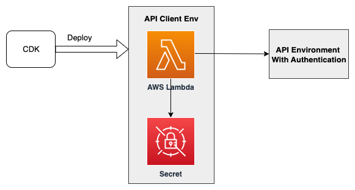

# Overview

This code implement a process using Lambda function and headless browsers to automatically login OIDC IdP, retrieve cookies and invoke API. You can use CDK to build AWS Resources and python code for Lambda function.

# User Guide

## Preparations

- Make sure you have an AWS account
- Configure [credential of aws cli][configure-aws-cli]
- Install Node.js LTS version 18.17.0 or later
- Install Docker Engine
- Initialize the CDK toolkit stack into AWS environment (only for deploying via [AWS CDK][aws-cdk] for the first time), and run `npx cdk bootstrap`

## Deployment
After cloning the code, execute the following CDK command to deploy the environment:
```shell
npm install
npx cdk deploy --parameters ServerUrl="https://<Server URL>" --parameters UserInfoSecretManagerName="<User Secret Name>" --parameters CookieSecretManagerName="<Cookie Secret Name>"
```

 - Server URL: API endpoint, for example: https://example.com
 - User Secret Name: The name of secret
 	it need to be created manually in Amazon Secret Manager and store the OIDC IdP user’s credential, like below:
 	{
	    "username":"<username>",
	    "password":"<password>"
	}
 - Cookie Secret Name: Specify the Secret name to save the cookie. In the code example, we store the obtained cookie to the Secret Manager and need to specify a secret name. The lambda function will create secret by this name.

 After the CDK deploy successfully, you will get the API client environment, the architecture as below: 

 

## Client Example:
After environment is deployment successfully, you can execute below aws cli command to trigger lambda function:

```shell
aws lambda invoke --function-name <lambda function name>

```
The cookie will be stored into secret manager after lambda function execute successfully.
Then you can write your code to read the cookie and call API with the cookie, below is an simple code example:

```python
def call_authentication_api(api_url, cookie):
  log.info(f"api_url: {api_url}")
  data = f"this is a test"
  headers = {"cookie": cookie}
  response = requests.post(api_url, headers=headers, data=data)
  log.info(f"response code: {response.status_code}")
  log.info(f"response url: {response.url}")
```

# License

This project is licensed under the Apache-2.0 License.

[configure-aws-cli]: https://docs.aws.amazon.com/zh_cn/cli/latest/userguide/cli-chap-configure.html
[aws-cdk]: https://aws.amazon.com/cdk/


